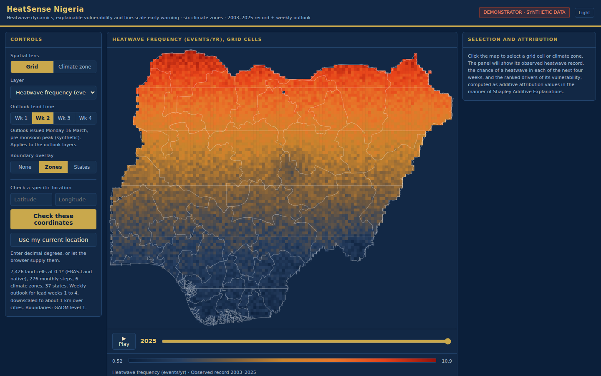
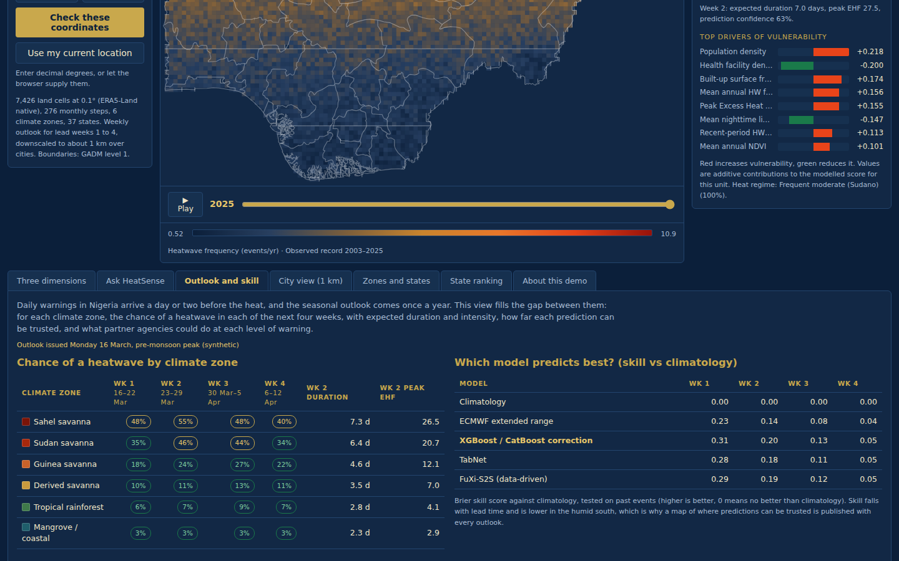
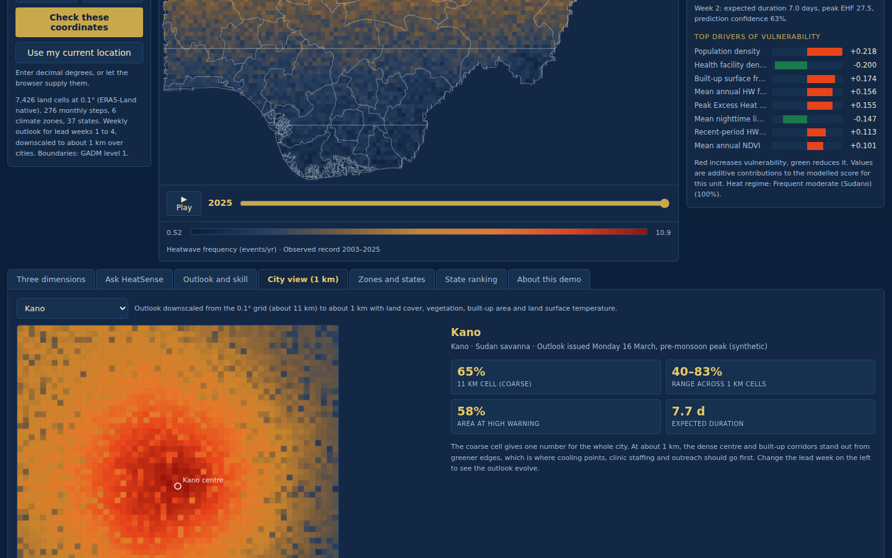
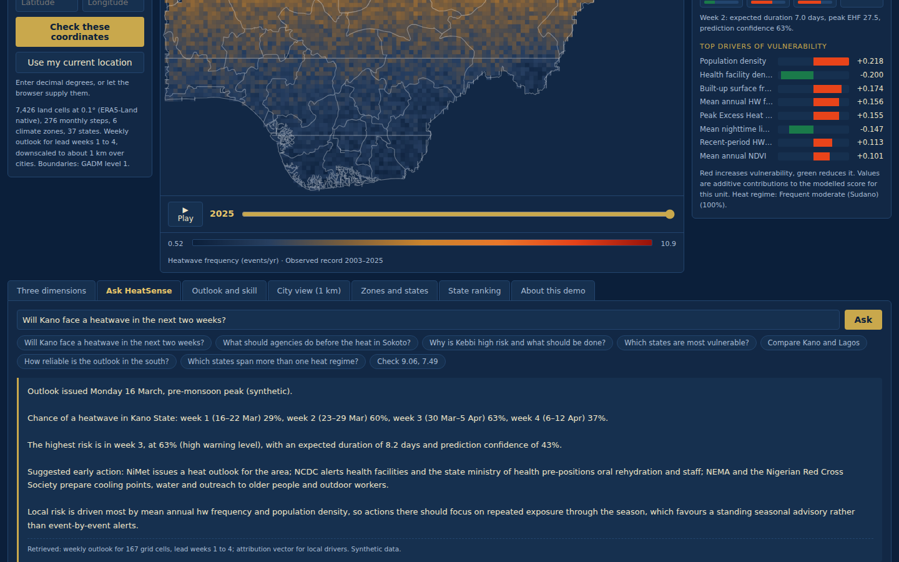

# HeatSense Nigeria

**An open-source geospatial AI system for heatwave characterisation, explainable vulnerability modelling and fine-scale early warning across Nigeria's climate zones.**

[](https://heatsense.netlify.app/)


**Live demo:** https://heatsense.netlify.app/



---

## Why I built this

Nigeria has no heat-health early warning system. Daily weather forecasts arrive a day or two before the heat, and the seasonal outlook comes once a year. Between the two there is nothing a health officer, an emergency planner or a family can act on, even though extreme heat is a growing and largely unseen health risk, hardest on older people at home with no way to cool down.

My own grandmother was one of them. That is why my research is about heat, and why HeatSense is designed to end with something agencies can actually use, not only a thesis.

HeatSense Nigeria is the system I am building to close that gap. It brings together three questions in one place:

1. **What is the heat doing?** How often heatwaves happen across Nigeria's six climate zones, how long they last, how intense they are, and how that has changed since 2003.
2. **Who is most at risk, and why?** Which places are most vulnerable, and which factors drive that vulnerability in each place.
3. **What is coming?** The chance of a heatwave in each of the next four weeks, at a scale fine enough for towns and cities, with a clear measure of how far each prediction can be trusted.

This repository holds the interactive demonstrator of the full system. It runs entirely in the browser and shows how the finished system will look and behave for its users.

---

## What the demonstrator does

| Feature | What it shows |
|---|---|
| **Observed record (2003 to 2025)** | Heatwave frequency, duration and intensity on a 7,426-cell grid at 0.1° (ERA5-Land native resolution), with an animated timeline across 276 monthly steps |
| **Three dimensions** | How frequency, duration and intensity relate to each other in each climate zone |
| **Trends and hotspots** | Where heat is rising, emerging or persistent, from space-time pattern mining |
| **Vulnerability and its drivers** | A vulnerability surface built from the IPCC risk components, with per-place driver attribution (explainable machine learning) shown as a ranked bar chart for any cell, zone or state |
| **Outlook and skill** | The chance of a heatwave by climate zone for lead weeks 1 to 4, expected duration and peak intensity, a skill comparison of five forecasting approaches against climatology, and the actions partner agencies could take at each warning level |
| **City view (1 km)** | The weekly outlook downscaled from the 0.1° grid to about 1 km over 17 Nigerian cities |
| **Zones and states** | Climate zones as the main unit of analysis, with state summaries for budgeting and planning |
| **State ranking** | All 37 states ranked by any layer |
| **Ask HeatSense** | Plain-English questions such as "Will Kano face a heatwave in the next two weeks?" or "Why is Kebbi high risk and what should be done?", answered only from values the system can retrieve |
| **Location lookup** | Type coordinates or use the device location to get the profile of the nearest analysis cell |

| Outlook and skill | City view (1 km) | Ask HeatSense |
|---|---|---|
|  |  |  |

The demonstrator runs on synthetic data generated to follow the patterns the research is expected to find, so that the system's design, interface and decision logic can be tested with users before the full analysis is complete. Administrative boundaries are real (GADM level 1, 37 units). The research pipeline described below replaces the synthetic layers with computed results as each phase is delivered.

---

## How it is built

The demonstrator is a single, dependency-free web application:

- **Plain JavaScript, HTML5 Canvas and CSS.** No frameworks, no build step, no server, no API keys.
- **Rendering:** the 7,426-cell grid, boundaries, legends and charts are drawn directly on Canvas 2D.
- **City view:** bilinear interpolation from the 0.1° grid to about 1 km, with a local colour stretch.
- **Data generator:** a seeded synthetic generator that reproduces the expected north to south gradients, seasonal timing, trends, vulnerability drivers and forecast skill decay with lead time.
- **Query engine:** a deterministic resolver behind Ask HeatSense that answers only from retrieved values, the same rule the full system's AI assistant will follow.
- **Deployment:** static hosting on Netlify; it also runs offline by opening `index.html` directly.

---

## The full system: four-tier open-source architecture

```
 Tier 1  Automated geospatial ETL        Google Earth Engine Python API, xarray, dask, rioxarray, geemap
         ERA5-Land, MODIS LST, WorldPop, GHSL, VIIRS, ESA WorldCover, ECMWF S2S  ->  Zarr / COG cubes
                         |
 Tier 2  Machine learning and XAI        scikit-learn, XGBoost, CatBoost, LightGBM, TabNet, PyTorch, SHAP, Optuna
         Hazard models, vulnerability surface, per-cell attribution matrix
                         |
 Tier 3  Prediction and spatial analytics GeoPandas, PySAL, esda, mgwr, pymannkendall, PostGIS, DuckDB
         Trend surfaces, hotspot classes, weekly heatwave predictions downscaled to ~1 km
                         |
 Tier 4  Natural language interface      LangGraph, LangChain, ChromaDB, FastAPI, open-weight LLM
         A grounded assistant that answers in plain English and cites the evidence behind every claim
```

Every component is open source, so Nigerian agencies can run and maintain the system themselves with no licence costs. More detail is in [docs/ARCHITECTURE.md](docs/ARCHITECTURE.md) and [docs/METHODOLOGY.md](docs/METHODOLOGY.md).

---

## Research objectives

The system is the core of my doctoral research, organised around four objectives, each producing a standalone paper:

**Understanding the hazard**
1. Characterise heatwave frequency, duration and intensity across Nigeria's six climate zones from 2003 to 2025, test their trends and identify emerging heat hotspots through space-time pattern mining implemented in open-source Python.

**Explaining and predicting**

2. Explain the drivers of heat hazard and population vulnerability with a hybrid explainable machine learning model (XGBoost, CatBoost, TabNet with SHAP, under spatially blocked validation) and spatially varying regression, and build an auditable vulnerability surface from the IPCC components.
3. Predict the probability, frequency, duration and intensity of heatwaves two to four weeks ahead with machine learning, downscaled to about 1 km over towns and cities and updated weekly, and test the predictions with partner agencies.

**Delivering**

4. Design, release and hand over a fully open-source geospatial AI system, including a retrieval-augmented assistant that gives non-specialist users grounded, locality-specific guidance, evaluated with Nigerian public health practitioners.

---

## Where the project is now

| Phase | Work | Status |
|---|---|---|
| **0. Foundations** | MSc research on air pollutants and land surface temperature across Nigeria using space-time pattern mining, published in *Theoretical and Applied Climatology* (2026) and awarded the 2026 Esri Young Scholar Award for Nigeria | Complete |
| **0. National pilot** | Heatwave characterisation and hybrid explainable machine learning vulnerability modelling across the six climate zones; manuscript under review at *Theoretical and Applied Climatology* | Complete |
| **0. Demonstrator v1** | First interactive demonstrator: observed record, vulnerability, drivers, plain-English queries | Complete |
| **0. Demonstrator v2** | Climate zones as the main unit, weekly outlook layers for lead weeks 1 to 4, forecast skill comparison, agency action table, 1 km city view | **Complete (October 2026), live** |
| **1. Ingestion pipeline** | Tier 1 automated ETL; partner requirements workshop | Planned, months 1 to 6 |
| **2. Hazard characterisation** | Heatwave metrics, trends and the open space-time cube package; Paper 1 | Planned, months 7 to 14 |
| **3. Vulnerability and drivers** | SHAP attribution, spatial regression, mid-project validation with agencies; Paper 2 | Planned, months 15 to 22 |
| **4. Prediction and assistant** | Two to four week prediction, 1 km downscaling, weekly outlook tested with partners, Tier 4 assistant; Papers 3 and 4 | Planned, months 23 to 30 |
| **5. Hand-over** | Warning thresholds agreed with partners, training, system transfer | Planned, months 31 to 36 |

The full plan, with deliverables per phase, is in [docs/ROADMAP.md](docs/ROADMAP.md).

---

## Who it is for

The system is designed with and for the agencies that act on heat in Nigeria:

| Partner | What they do now | What HeatSense adds |
|---|---|---|
| Nigerian Meteorological Agency (NiMet) | Daily forecasts and the annual Seasonal Climate Prediction | A weekly heat outlook for weeks 1 to 4 that fills the gap between the two |
| Nigeria Centre for Disease Control (NCDC) | Disease surveillance and outbreak response | Advance notice of heat stress to prepare health facilities and messaging |
| National Emergency Management Agency (NEMA) | Disaster preparedness and response | Location-specific heat risk for planning before the event |
| Nigerian Red Cross Society | Community outreach and anticipatory action | Triggers and lead time for early action in the most vulnerable places |
| State ministries of health | Health services at state level | State summaries and city-level outlooks for local planning |

---

## Run it locally

No installation is needed.

```bash
git clone https://github.com/Bherney/heatsense-nigeria.git
cd heatsense-nigeria
```

Then either open `index.html` in any modern browser, or serve it locally (needed for the "Use my current location" button, because browsers only allow geolocation over http or https):

```bash
python3 -m http.server 8000
# open http://localhost:8000
```

---

## Repository structure

```
heatsense-nigeria/
├── index.html              The full application (single file, no dependencies)
├── netlify.toml            Netlify deployment settings
├── assets/screenshots/     Interface screenshots
├── docs/
│   ├── ARCHITECTURE.md     The four-tier system design
│   ├── METHODOLOGY.md      Data, methods and validation
│   └── ROADMAP.md          Phases, deliverables and current status
├── CHANGELOG.md            Version history
├── CITATION.cff            How to cite this work
└── LICENSE                 MIT
```

---

## Related work

- Waheeb, T., Adeyefa, A. and Oguntoyinbo, O. (2026). Pattern of air pollutants and land surface temperature in Nigeria using space-time pattern mining techniques. *Theoretical and Applied Climatology*, 157, 579. https://doi.org/10.1007/s00704-026-06507-1
- Waheeb, T. B., Adeyefa, A. O. and Odeleye, O. (2026). Spatiotemporal dynamics, drivers and population vulnerability of heatwaves across Nigeria's climate zones. Under review, *Theoretical and Applied Climatology*.
- Waheeb, T. B., Odeleye, O. and Adeyefa, A. O. (2026). Characterising the surface urban heat island of Ibadan, Nigeria: hot-spot clustering and its relationship with vegetation and land cover. Under review, *Discover Geoscience*.

---

## Author

**Temitope Benedict Waheeb**
Geospatial scientist and geoscientist, Ibadan, Nigeria
MSc Geo-Information Science, University of Ibadan · 2026 Esri Young Scholar, Nigeria · Founder, GeoDev Lab Africa

[LinkedIn](https://linkedin.com/in/temitopewaheeb) · [Portfolio](https://bherney.github.io/Portfolio/) · [ORCID 0009-0009-2401-6481](https://orcid.org/0009-0009-2401-6481) · waheebtemitope@gmail.com

---

## Licence and data

Code is released under the [MIT Licence](LICENSE). Administrative boundaries: GADM version 4.1, Nigeria level 1 (simplified). The demonstrator is a design and research prototype and is not intended for operational warning.
